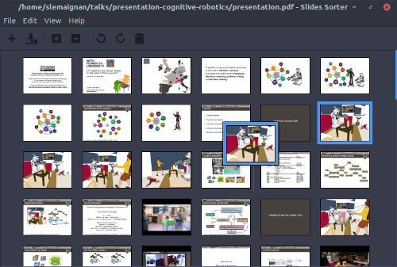

Slides Sorter
=============


Reorganizing Latex Beamer slides made easy!



Slides sorter is a small utility that:

- opens a PDF file
- attempts to open the matching Beamer Latex source
- let you re-arrange your slides (re-order, remove some, etc)
- save the resulting PDF **and updated Beamer source**.

You can then directly use the edited PDF or better, re-compile your Beamer
source to get right all the links and navigation bar.

**Slides Sorter is heavily based on
[pdfshuffler](https://sourceforge.net/projects/pdfshuffler/) by Konstantinos Poulios**. Kudos to him!

Installation
------------

On Linux, install first the dependencies: `python-pypdf`, `python-poppler` and `python-gtk2`
(on Ubuntu/Debian, `sudo apt install python-pypdf python-poppler python-gtk2`).

Then:
```
$ git clone https://github.com/severin-lemaignan/slidessorter.git
$ cd slidessorter
$ sudo python setup install
```

License
-------

Like its parent, `pdfshuffler`, `slidessorter` is release under the [GPLv3 license](COPYING).
